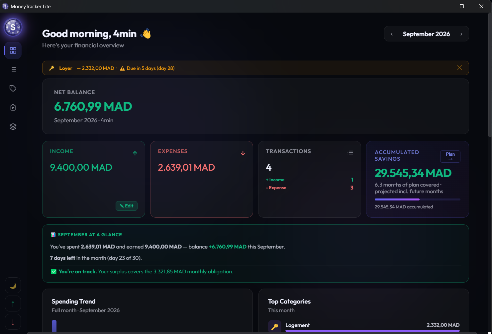

# MoneyTracker Lite

[](https://ko-fi.com/4mintimeout)
[](LICENSE)

A free, offline, fully-encrypted personal finance tracker for Windows. Log expenses and income, track recurring transactions, plan savings, and manage budgets — all stored locally on your machine, encrypted, no account, no cloud, no tracking.



## Features

- 🔒 Local encryption (your data never leaves your computer)
- 💸 Expense & income tracking with categories
- 🔁 Recurring transactions
- 🎯 Savings goals
- 📊 Monthly dashboard & spending breakdowns
- 🌐 Duo-language support

## Annual Savings Plan

Most expense trackers only show you the past — what you already spent. The Annual Savings Plan shows you the whole year at once, so you can actually plan ahead instead of reacting month to month.

Here's how it helps:

See your big expenses coming before they hit. Annual bills (insurance, subscriptions, taxes) and installment payments get laid out across the whole year.
Know how much you're really saving — not just this month, but overall. The plan tracks your projected savings (based on your whole year's plan) side by side with your actual savings so far (based on completed months), so you always know where you stand versus where you're headed.
Catch a bad month early. Each month is broken down with its own income, expenses, and balance, so if spending creeps up, you'll see it in that month's card instead of finding out three months later when your savings goal falls short.
Plan around irregular, one-off expenses. Life events (holidays, annual insurance, a big seasonal purchase) rarely land evenly across the year, this view is built for exactly that kind of lumpy, real-life spending, not just a flat monthly average.

In short: instead of asking "how much did I spend this month," it answers the more useful question — "am I actually on track for the year?"

## Bank Import

No more typing in every transaction by hand. If your bank is one of the UK's major providers, you can export your transaction history and drop it straight into MoneyTracker Lite:

Supported so far: Monzo, Starling, Barclays, HSBC, Lloyds/Halifax, and NatWest/RBS — via CSV, and OFX/QFX for the banks that offer it.
How it works: export your transactions from your bank's app or online banking (usually under Statements or Export), then drag the file into MoneyTracker Lite or click to browse for it.
Nothing gets added blindly. Before anything is saved, you get a preview of the incoming transactions and a duplicate check — if a transaction looks like it might already be in your records, you'll be asked what to do rather than ending up with double entries.
Your export never leaves your computer. Like everything else in the app, the file is parsed and imported locally — nothing is uploaded anywhere.

## Download

Grab the latest installer from the [Releases](../../releases) page.
⚠️ Windows may show a "Windows protected your PC" SmartScreen warning. This happens because the app isn't code-signed yet (code-signing certificates cost money, which isn't in the budget for a free hobby project right now). This is normal and does not mean the app is unsafe — the source code is fully open in this repo for anyone to inspect.

To run it: click More info, then Run anyway.

## Building from source

```bash
git clone https://github.com/your-github-username/moneytracker-lite.git
cd moneytracker-lite
npm install
npm start          # run in dev mode
npm run dist        # build the Windows installer (output in dist/)
```

## Support this project

MoneyTracker Lite is free and always will be. If it's useful to you, consider supporting development:

- [Ko-fi](https://ko-fi.com/4mintimeout) ☕

## License

MIT see [LICENSE](LICENSE).
